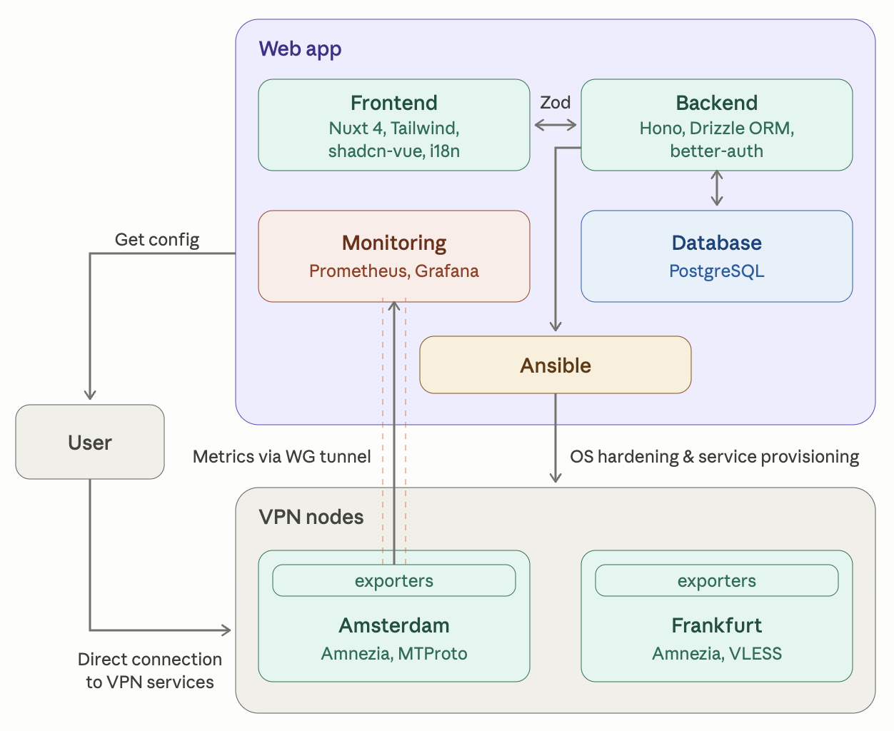
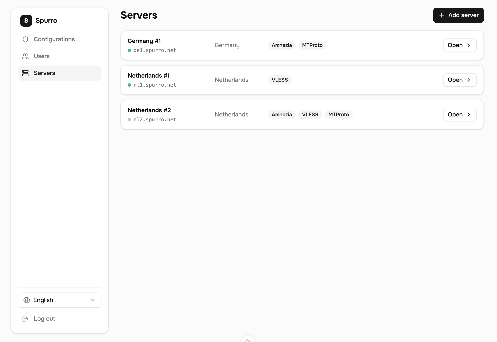
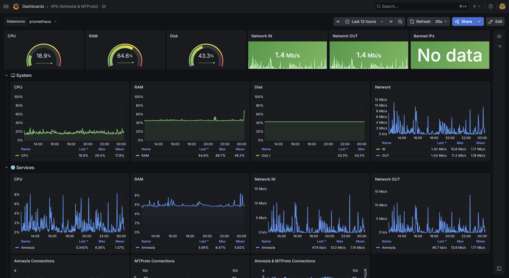

# Spurro

A platform for sharing a private VPN network with invited users — deployment, configuration and monitoring of VPN servers are fully automated.

## Why

I've been running a self-hosted VPN service for family and friends for a while — hand-configured VPS servers with a monitoring system I built to keep an eye on server load.

Once my own user count passed 10, and friends started adopting the same setup to run it for their own circles, several problems emerged:

- Every new server meant repeating OS hardening and server configuration by hand.
- Adding a new protocol meant generating client configs and sending them to every user individually.
- Adding a new user meant generating configs manually and walking them through the VPN setup process.

To solve these problems, I decided to build a system of my own — one that makes life easier both for me and for the people using the service.

## Architecture

The diagram below shows the initial system design — it will likely evolve as implementation progresses.

<!-- ARCHITECTURE DIAGRAM -->

The system has two roles:

- Admin
  - Grants access to the service by adding a user's email.
  - Manages VPN nodes — deployment and configuration are fully automated.
  - Manages users and their configs.
  - Has access to the monitoring system.
- User
  - Generates VPN configs for themselves.
  - Gets setup instructions for their devices.
  - Gets email notifications about changes.

## Web interface

The interface is built on shadcn-vue with minimal customization to save development time. It supports two languages — Russian and English — and is fully responsive, down to 380px-wide screens.

MVP version of the admin interface, with mock data:

<!-- ADMIN UI SCREENSHOT -->

## Monitoring System

The monitoring system shows load and issues for every node. It will be built on top of the monitoring setup already running in production on one of my servers — the screenshot below shows the real system.

<!-- MONITORING SCREENSHOT -->

## Docs

- [Frontend architecture](./frontend/ARCHITECTURE.md)
- [Backend architecture](./backend/ARCHITECTURE.md)
