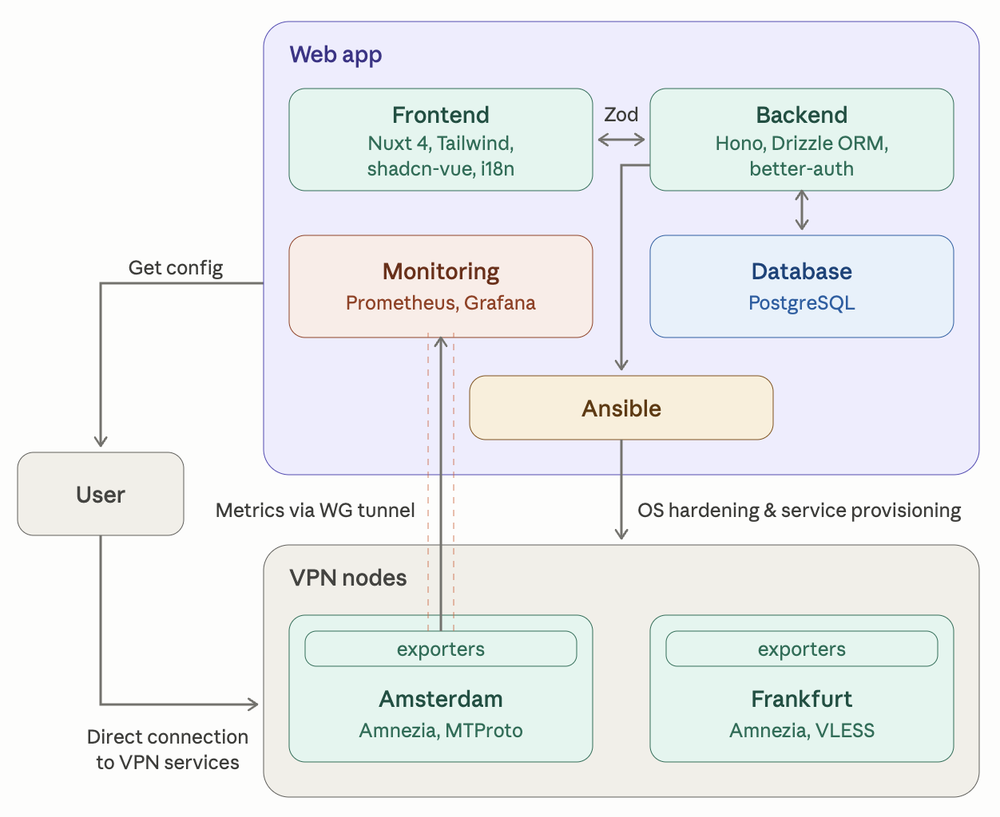

# Spurro

A platform for sharing a private VPN network with invited users — deployment, configuration and monitoring of VPN servers are fully automated.

## Architecture

The diagram below shows the initial system design — it will likely evolve as implementation progresses.

<!-- ARCHITECTURE DIAGRAM -->

The system has two roles:

- Admin
  - Grants access to the service by adding a user's email.
  - Manages VPN nodes — deployment and configuration are fully automated.
  - Manages users and their configs.
  - Has access to the monitoring system.
- User
  - Generates VPN configs for themselves.
  - Gets setup instructions for their devices.
  - Gets email notifications about changes.

## Docs

- [Frontend architecture](./frontend/ARCHITECTURE.md)
- [Backend architecture](./backend/ARCHITECTURE.md)
